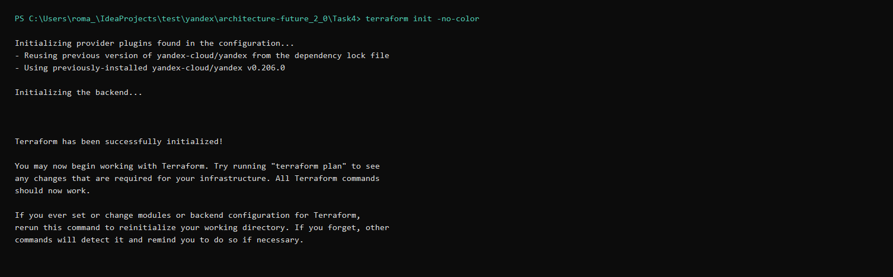
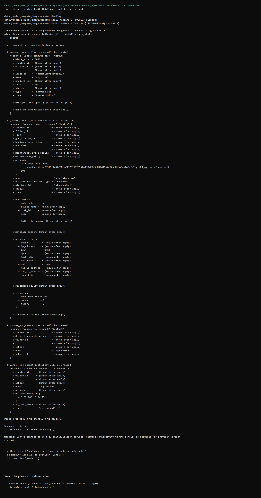
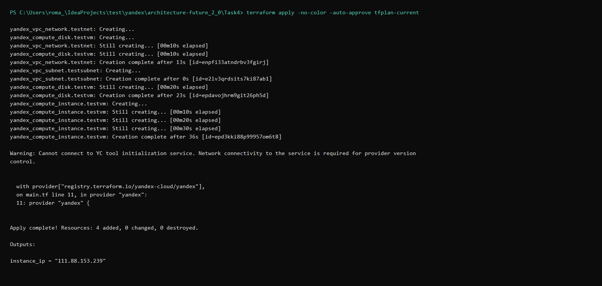

# Автоматизация развёртывания

Процесс начинается с изменения кода в Git-репозитории. После отправки коммита или слияния изменений в ветку `main` CI/CD-сервер запускает конвейер: собирает Docker-образ и выполняет автоматические тесты.

Если тесты завершились успешно, конвейер продолжает работу по двум направлениям:

- готовый образ публикуется в Yandex Container Registry;
- Terraform формирует план изменений и создаёт или обновляет инфраструктуру в Yandex Cloud.

Terraform отвечает за сеть, подсеть, загрузочный диск, виртуальную машину и публичный IP-адрес. Развёртывание приложения на подготовленной машине выполняется отдельным инструментом, например Ansible, `cloud-init` или SSH. На этом этапе устанавливается Docker, из реестра загружается нужный образ и запускается контейнер.

Исходная схема доступна в двух форматах:

- [редактируемая диаграмма draw.io](diagram.drawio);
- [изображение PNG](diagram.png).

## Почему выбран декларативный подход

Infrastructure as Code позволяет хранить описание инфраструктуры вместе с кодом приложения и применять к нему обычные инженерные практики: контроль версий, проверку изменений и автоматический запуск из CI/CD.

Terraform использует декларативную модель. В конфигурации задаётся требуемый результат, а инструмент самостоятельно определяет, какие операции нужны для перехода от текущего состояния к целевому.

Основные различия между декларативным и императивным подходами:

- **Цель описания.** Декларативная конфигурация фиксирует, какое состояние должно быть получено. Императивный сценарий задаёт последовательность команд для его достижения.
- **Работа с состоянием.** Terraform сравнивает фактические ресурсы с конфигурацией и строит план изменений. В императивном сценарии контроль текущего состояния требуется реализовать отдельно.
- **Повторный запуск.** Декларативные операции рассчитаны на повторное применение без создания лишних ресурсов. Для набора команд идемпотентность зависит от реализации каждой операции.
- **Управление изменениями.** Перед применением Terraform показывает результат через `terraform plan`. Императивный сценарий обычно не предоставляет общего плана автоматически.
- **Область применения.** Terraform подходит для создания облачной инфраструктуры, а Ansible и аналогичные инструменты удобны для настройки операционной системы и установки приложения.

Преимущества выбранного подхода:

- конфигурация инфраструктуры хранится в Git и проходит code review;
- одинаковое описание можно применять повторно для воспроизводимого стенда;
- план изменений позволяет проверить действия до их выполнения;
- ручных операций становится меньше, а вероятность расхождения окружений снижается;
- параметры ресурсов вынесены в переменные и меняются без переработки основной конфигурации.

Ограничения подхода:

- Terraform должен хранить актуальное состояние инфраструктуры;
- ошибки в конфигурации или состоянии могут привести к нежелательным изменениям ресурсов;
- установку программ внутри виртуальной машины удобнее выполнять средствами управления конфигурацией;
- для работы требуется доступ к API облачного провайдера и корректно настроенная авторизация.

## Конфигурация тестового стенда

Terraform создаёт в Yandex Cloud следующие ресурсы:

- сеть `app-network`;
- подсеть `app-subnet` с диапазоном `192.168.10.0/24` в зоне `ru-central1-b`;
- SSD-диск `app-disk` объёмом 20 ГБ на базе образа Ubuntu 22.04 LTS;
- виртуальную машину `app-future-vm` с двумя ядрами CPU и 2 ГБ оперативной памяти;
- сетевой интерфейс с NAT и публичным IP-адресом;
- SSH-доступ для пользователя `ubuntu` по открытому ключу.

Размер диска, число ядер, объём памяти, идентификатор каталога и путь к SSH-ключу задаются через переменные Terraform. Публичный IP созданной машины возвращается в выходном параметре `instance_ip`.

После подтверждения плана Terraform создаёт сеть, подсеть, диск и виртуальную машину. Адрес машины выводится как `instance_ip`.

## Результаты развёртывания

### Инициализация Terraform

Команда:

```powershell
terraform init -no-color
```

Основной результат:

```text
Initializing provider plugins found in the configuration...
- Reusing previous version of yandex-cloud/yandex from the dependency lock file
- Using previously-installed yandex-cloud/yandex v0.206.0

Initializing the backend...

Terraform has been successfully initialized!
```

Полный вывод команды сохранён в файле [terraform-init.log](terraform-init.log).



### Построение плана

План сформирован с явным указанием каталога Yandex Cloud и сохранён в файл `tfplan-current`:

```powershell
terraform plan -no-color `
  -var="folder_id=b1gss8h4dtll6dm2o2qc" `
  -out=tfplan-current
```

Terraform запланировал создание четырёх ресурсов без изменения или удаления существующей инфраструктуры:

```text
Plan: 4 to add, 0 to change, 0 to destroy.

Changes to Outputs:
  + instance_ip = (known after apply)

Saved the plan to: tfplan-current
```

В план вошли:

- сеть `app-network`;
- подсеть `app-subnet`;
- SSD-диск `app-disk` объёмом 20 ГБ;
- виртуальная машина `app-future-vm`.

Полный вывод доступен в файле [terraform-plan.log](terraform-plan.log).



### Применение плана

Для развёртывания применён ранее сохранённый план:

```powershell
terraform apply -no-color -auto-approve tfplan-current
```

Результат выполнения:

```text
yandex_vpc_network.testnet: Creation complete
yandex_vpc_subnet.testsubnet: Creation complete
yandex_compute_disk.testvm: Creation complete
yandex_compute_instance.testvm: Creation complete

Apply complete! Resources: 4 added, 0 changed, 0 destroyed.

Outputs:

instance_ip = "111.88.153.239"
```

После развёртывания Yandex Cloud сообщил для виртуальной машины статус `RUNNING`. Ей назначены внутренний адрес `192.168.10.18` и публичный адрес `111.88.153.239`.

Полный протокол применения плана сохранён в файле [terraform-apply.log](terraform-apply.log).



### Проверка состояния

После завершения развёртывания повторно выполнена команда `terraform plan`. Terraform обновил локальное состояние и не обнаружил отличий между конфигурацией и фактической инфраструктурой:

```text
No changes. Your infrastructure matches the configuration.

Terraform has compared your real infrastructure against your configuration
and found no differences, so no changes are needed.
```

Таким образом, конфигурация применена полностью, а созданные ресурсы соответствуют Terraform-описанию. 

Для удаления тестовых ресурсов используется команда:

```powershell
terraform destroy
```
